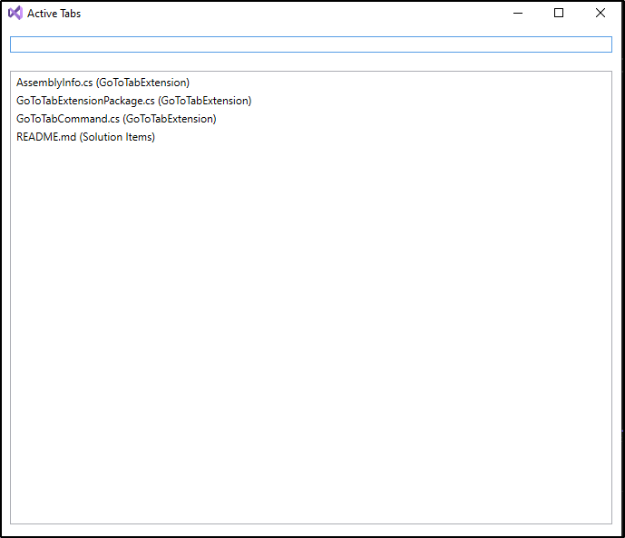

# Go To Tab Visual Studio Extension 🚀  

Have you ever struggled to find the right tab when too many are open? Has your tab list taken up half the screen?  

If your answer is **yes**, then this extension is for you!  

### 🔹 How to Use  
Press `Ctrl+O` to open the **Active Tabs Window**.  

### ✨ Features  
- ✅ **View** a list of all active tabs.  
- 🔍 **Search** for a tab by name.  
- 📌 **Sort** tabs by the last opened time—recently accessed files appear at the top.  

Make navigating your open files **faster and easier** with the **Go To Tab Extension**! 🚀  

